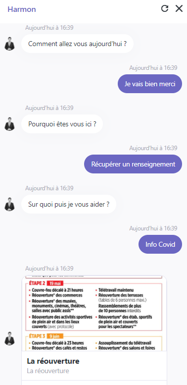
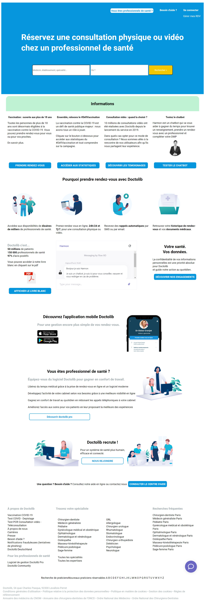

# Harmon

Harmon est un projet d'outil conversationnel développé par l'entreprise M&R Inov <br>
Il s'agit d'un chatbot médical qui peut vous donner des renseignements pour vous rassurer, vous aider à remplir votre DMP et vous aiguiller dans la recherche d'un praticien.
A l'heure actuelle, nous en sommes à la POC (proof of concept).

## Installation :

```
    git clone git@github.com:EpitechDigital2020/D-ELI-200_2025_robin.mahe.git
```

## Utilisation :

```
    Cliquez sur la landing page "Doctolib.html" et utilisez le chatbot
    Vous pourrez accéder au Livre Blanc en le téléchargeant depuis la landing page.
```

## Contenu du Repo :

```
    |docs                       (Tous les documents rendus pour le projet)
        - Fiche_de_suivi.pdf    (la fiche de suivi envoyé par le chatbot après le diagnostique)
        - Livre_Blanc           (Le livre blanc disponible au téléchargement sur la landing page)

    |img                        (toutes les images utilisées sur la landing page)

    - Doctolib.html             (La landing page)
    - README.md                 (La page que vous êtes actuellement entrain de consulter)
    - style.css                 (le style de la landing page)
```

## Auteurs :

```
    M&R Inov
    Robin MAHE : robin.mahe@epitech.digital
    &
    Emma-Loïse QUIN : emma-loise.quin@epitech.digital
```

## Avancement du projet :

```
    Nous en sommes à la proof of concept.
```

**Vous pouvez tester le chatbot :** [Harmon](https://fxo.io/m/fishes-responsive-2963)





